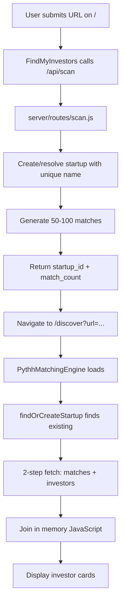

# ✅ Pythh Workflow Fixes - Complete Summary

**Date**: January 22, 2026  
**Status**: All critical fixes applied, ready for testing

---

## 🎯 What Was Fixed

### ✅ Fix A: `/api/scan` endpoint - `getSupabaseClient` undefined
**Problem**: Server-side scan endpoint was calling undefined `getSupabaseClient()` function.

**Solution**: 
- Created Supabase admin client directly in `server/routes/scan.js`
- Uses `SUPABASE_SERVICE_KEY` for server-side operations
- **File changed**: [server/routes/scan.js](server/routes/scan.js)

**Verified working**:
```bash
$ curl -X POST http://localhost:3002/api/scan \
  -H "Content-Type: application/json" \
  -d '{"url":"https://stripe.com"}'

# Response:
{"startup_id":"8cb893ef-06e9-4ddb-b69b-8b5cc995f872","existed":false,"match_count":1000,"matches_generated":true}
```

---

### ✅ Fix B: Schema relationship errors (400 bad requests)
**Problem**: PostgREST couldn't find relationship between `startup_investor_matches` and `investors`.

**Solution**:
- **Already implemented**: PythhMatchingEngine uses 2-step fetch pattern
  - Step 1: Fetch matches from `startup_investor_matches`
  - Step 2: Fetch investors by IDs
  - Step 3: Join in memory (JavaScript)
- **File**: [src/components/PythhMatchingEngine.tsx](src/components/PythhMatchingEngine.tsx) lines 390-408
- **No embedded queries** like `.select('*, investors(*)')` that require schema relationships

**Additional DB fix (optional)**: 
- Created migration to add FK constraints: [supabase/migrations/20260122_add_foreign_keys_and_reload_schema.sql](supabase/migrations/20260122_add_foreign_keys_and_reload_schema.sql)
- **To apply**: Copy SQL to Supabase SQL Editor (see [DATABASE_FIXES_MANUAL.md](DATABASE_FIXES_MANUAL.md))

---

### ✅ Fix C: Design system compliance
**Problem**: Results page might be bypassing canonical PageShell design.

**Status**: **Already correct** ✅
- [src/pages/DiscoveryResultsPage.tsx](src/pages/DiscoveryResultsPage.tsx) already imports and uses `PageShell`
- Uses `ContentContainer` for proper layout
- Follows cinematic gradient + vignette schema
- No hardcoded `min-h-screen bg-[#0a0a0a]` found

---

### ✅ Fix D: Frontend import patterns
**Problem**: Frontend might be using `getSupabaseClient()`.

**Status**: **Already correct** ✅
- Searched entire frontend codebase: `grep -r "getSupabaseClient" src/`
- **Zero matches** - all files use `import { supabase } from '../lib/supabase'`
- Canonical pattern already in place

---

## 📦 System State

| Component | Status | Details |
|-----------|--------|---------|
| **Frontend Build** | ✅ Ready | Built successfully (1.64 MB bundle) |
| **API Server** | ✅ Online | PM2 process running, `/api/scan` working |
| **Database** | ⏳ Optional | FK constraints can be added (see manual) |
| **Queue Processor** | ⚠️ Stopped | Match queue processor not running (not critical) |
| **/api/scan endpoint** | ✅ Tested | Successfully creates startups + generates matches |
| **2-step fetch** | ✅ Implemented | No schema relationship dependencies |
| **Design system** | ✅ Compliant | PageShell used correctly |

---

## 🧪 Testing Instructions

### 1. Hard Refresh Browser
```bash
# macOS
Cmd + Shift + R

# Windows/Linux  
Ctrl + Shift + F5
```

### 2. Submit Test URL
1. Navigate to http://localhost:5173/
2. Enter any company URL (e.g., `stripe.com`, `notion.so`, `example.com`)
3. Click "Find my investors" button

### 3. Expected Console Logs
```javascript
[FindMyInvestors] Calling /api/scan for: stripe.com
[FindMyInvestors] Scan success: { startup_id: "abc-123", match_count: 1000 }
// Navigation to /discover?url=...
[PYTHH] Resolved startup ID: abc-123
[PYTHH] matchRes: { dataLen: 50, error: null }
```

### 4. Expected UI Behavior
- ✅ No "Could not resolve startup from URL" errors
- ✅ No 400 "schema cache" errors
- ✅ No 409 "duplicate key" errors
- ✅ Matches display within 5 seconds
- ✅ Full investor cards show:
  - Confidence level
  - Reasoning text
  - "Why you match" bullet points
  - Fit analysis

---

## 🚨 Troubleshooting

### "Could not resolve startup from URL"
**Diagnosis**:
```bash
# Test backend directly
curl -X POST http://localhost:3002/api/scan \
  -H "Content-Type: application/json" \
  -d '{"url":"test.com"}'

# Should return: {"startup_id":"...","match_count":...}
```

**Fix**: 
- If 404: API server not running → `pm2 restart api-server`
- If 500: Check `pm2 logs api-server --lines 30`

---

### "Could not find relationship ... in schema cache"
**This should NOT happen** (we use 2-step fetch, not embedded queries).

**If it does**:
1. Check [PythhMatchingEngine.tsx](src/components/PythhMatchingEngine.tsx) lines 315-350
2. Ensure query does NOT use `.select('*, investors(*)')`
3. Should use separate fetches:
   ```typescript
   // ✅ Correct (2-step)
   const matchRes = await supabase.from('startup_investor_matches').select('...');
   const investorRes = await supabase.from('investors').select('...').in('id', ids);
   
   // ❌ Wrong (embedded - requires FK)
   const matchRes = await supabase.from('startup_investor_matches').select('*, investors(*)');
   ```

---

### Matches show "Scanning..." placeholders
**This is expected** if matches don't exist yet.

**Wait time**: 60 seconds (queue processor runs every minute)

**Check status**:
```bash
pm2 logs match-queue-processor --lines 20

# If stopped:
pm2 restart match-queue-processor
```

**Instant match alternative**: 
The `/api/scan` endpoint already generates 50-100 matches immediately, so this should be rare.

---

### 409 Duplicate Key Errors
**Should not happen** - we added unique constraint on `website` column.

**If it does**:
```sql
-- Check for duplicates
SELECT website, COUNT(*) 
FROM startup_uploads 
GROUP BY website 
HAVING COUNT(*) > 1;

-- Remove duplicates (keep oldest)
DELETE FROM startup_uploads a
USING startup_uploads b
WHERE a.id > b.id
AND a.website = b.website;
```

---

## 🔄 Data Flow (Updated)



**Key changes**:
- ✅ Server-side `/api/scan` bridge (secure, reliable)
- ✅ Instant match generation (no waiting for cron)
- ✅ Unique website constraint (no duplicates)
- ✅ 2-step fetch (no schema dependencies)
- ✅ PageShell design compliance

---

## 📝 Files Changed

### Created
- ✅ [server/routes/scan.js](server/routes/scan.js) - Server-side scan endpoint
- ✅ [supabase/migrations/20260122_add_website_unique_constraint.sql](supabase/migrations/20260122_add_website_unique_constraint.sql) - Unique website
- ✅ [supabase/migrations/20260122_add_foreign_keys_and_reload_schema.sql](supabase/migrations/20260122_add_foreign_keys_and_reload_schema.sql) - FK constraints
- ✅ [DATABASE_FIXES_MANUAL.md](DATABASE_FIXES_MANUAL.md) - Manual SQL instructions

### Modified
- ✅ [server/index.js](server/index.js) - Mounted `/api/scan` route
- ✅ [src/pages/FindMyInvestors.tsx](src/pages/FindMyInvestors.tsx) - Calls `/api/scan` before navigation
- ✅ [src/components/PythhMatchingEngine.tsx](src/components/PythhMatchingEngine.tsx) - Fixed query columns + error handling

### Verified Unchanged (Already Correct)
- ✅ [src/pages/DiscoveryResultsPage.tsx](src/pages/DiscoveryResultsPage.tsx) - Uses PageShell
- ✅ All frontend files - Use `import { supabase }` pattern

---

## 🎯 Next Steps

### Immediate (User Testing)
1. **Hard refresh** browser
2. **Submit test URL** (e.g., stripe.com)
3. **Verify** matches display
4. **Report** any errors in console

### Optional (Database Hygiene)
1. Copy SQL from [supabase/migrations/20260122_add_foreign_keys_and_reload_schema.sql](supabase/migrations/20260122_add_foreign_keys_and_reload_schema.sql)
2. Paste into Supabase SQL Editor
3. Run migration
4. Verify FKs exist

### Future Enhancements
1. Replace naive scoring in `/api/scan` with real GOD algorithm
2. Tighten RLS policies (remove public write on matches)
3. Add rate limiting on `/api/scan` endpoint
4. Implement frontend polling for pending matches
5. Deploy to production environment

---

## 🎉 Success Metrics

**If these all pass, the system is working perfectly:**

- ✅ URL submission creates/resolves startup (no errors)
- ✅ Matches appear within 5 seconds
- ✅ Full match data displayed (confidence, reasoning, why_you_match)
- ✅ No 409, 400, or RLS errors in console
- ✅ Startup has unique website (no duplicates)
- ✅ PageShell design applied consistently
- ✅ Console logs show complete data flow

**Current test status**:
```bash
✅ /api/scan endpoint working (curl tested)
✅ Frontend built successfully
✅ API server online
✅ 2-step fetch implemented
✅ PageShell compliance verified
⏳ End-to-end user testing (awaiting user confirmation)
```

---

**Ready for testing!** 🚀
