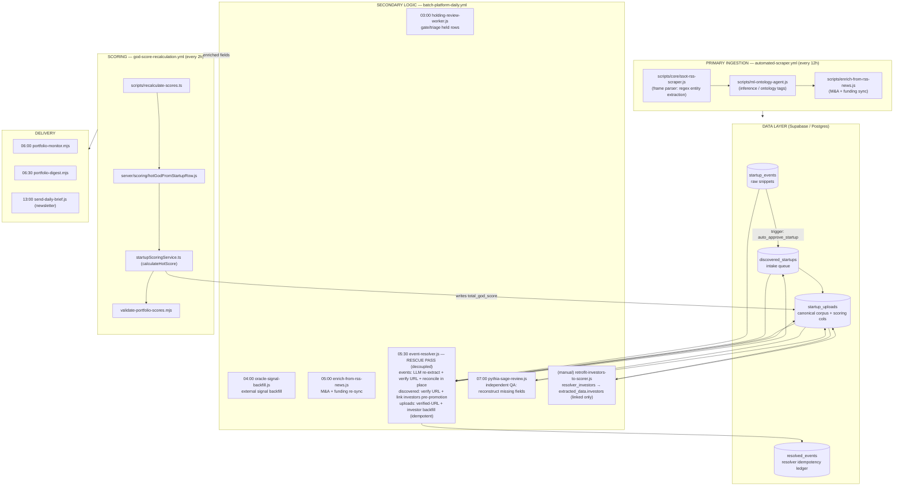

# PYTHH Data Pipeline — Secondary Logic & Scoring

How raw RSS ingestion flows through the **second-pass enrichment scripts** into the
GOD score. Cadences and commands are sourced from the live workflows:
`automated-scraper.yml`, `batch-platform-daily.yml`, and `god-score-recalculation.yml`.

> **Core principle:** second-pass scripts only write *inputs* (website, investors,
> sectors, funding, web_signals). Scores are computed in exactly one place — the
> 2-hourly recalc — so no script forks the scoring math.

## Flow

## Secondary scripts reference

| Script | Trigger | Reads | Writes | Feeds score? |
|---|---|---|---|---|
| `enrich-from-rss-news.js` | scraper + 05:00 daily | RSS news | funding / M&A fields | indirect |
| `event-resolver.js` `--source events` | 05:30 daily | `startup_events` | reconciles `startup_uploads` / `discovered_startups`, `resolved_events` | yes (name / url / investors) |
| `event-resolver.js` `--source discovered` | 05:30 daily | `discovered_startups` | website + investors pre-promotion | yes |
| `event-resolver.js` `--source uploads` | 05:30 daily | `startup_uploads` (no website) | website + `extracted_data.investors` | yes (+0.5 url, +0.2/0.5 inv) |
| `pythia-sage-review.js` | 07:00 daily | `startup_uploads` | reconstructed `extracted_data` | indirect |
| `retrofit-investors-to-scorer.js` | manual one-off | `extracted_data.resolver_investors` | `extracted_data.investors` (linked only) | yes |
| `recalculate-scores.ts` | every 2h | enriched columns | `total_god_score` | **applies it** |

## Scoring inputs the second pass unlocks

The scorer reads these row fields (see `server/scoring/hotGodFromStartupRow.js`
mapping → `startupScoringService.ts` math):

- **`website`** → `+0.5` baseBoost (real web presence). Also unlocks future
  web-signal scraping (press tiers, blog, reddit) which can add up to ~`+0.9`.
- **`extracted_data.investors`** → mapped to `backed_by`; `+0.2` for any matched
  investor, `+0.5` when a top-tier fund (YC / Sequoia / a16z / Founders Fund) is
  named. Only investors **linked to the canonical `investors` table** are written,
  so unverified mentions don't inflate the signal.
- **`sectors`, funding, traction** → standard market/traction/funding components.

## Design invariants

1. **Resolver is decoupled** — never touches the scraper; reads `startup_events`
   and reconciles downstream rows, with `resolved_events` as the idempotency ledger.
2. **Enrichment ≠ scoring** — second-pass scripts write inputs only; the 2-hourly
   recalc is the single source of truth for `total_god_score`.
3. **Ordering** — resolver (05:30) runs before Sage (07:00) so Sage sees more
   complete data; both land before the next recalc applies the changes.
4. **Idempotent backfills** — `event-resolver.js` uploads/discovered modes stamp
   `url_enriched_at`; re-runs skip already-processed rows unless `--force`.
