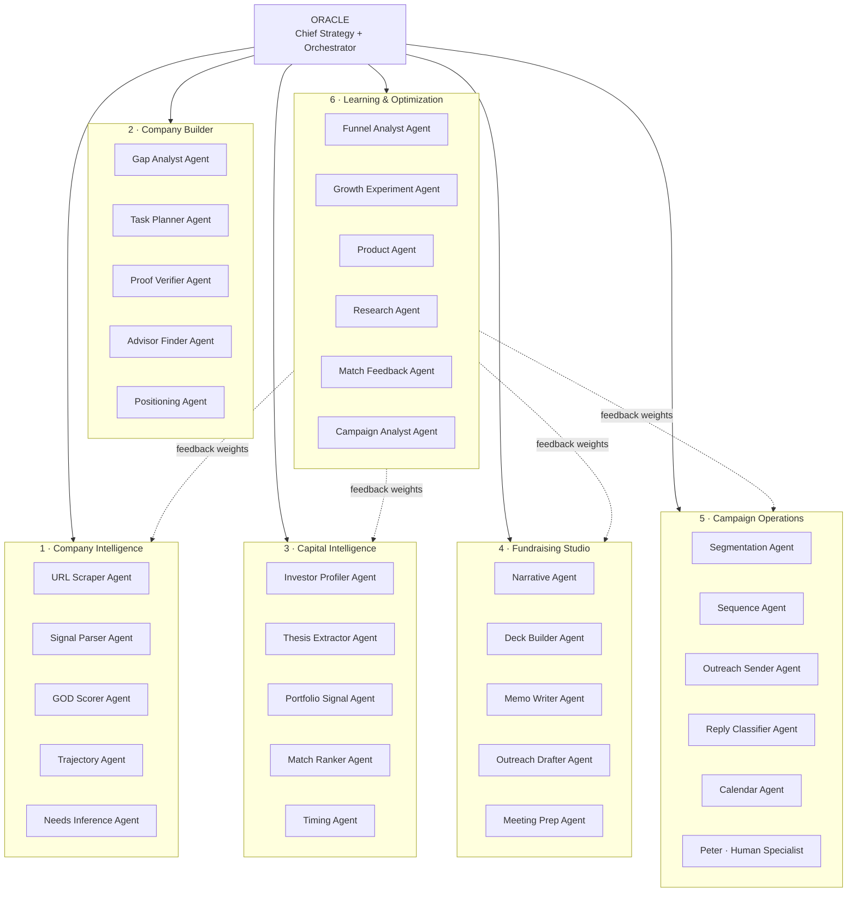
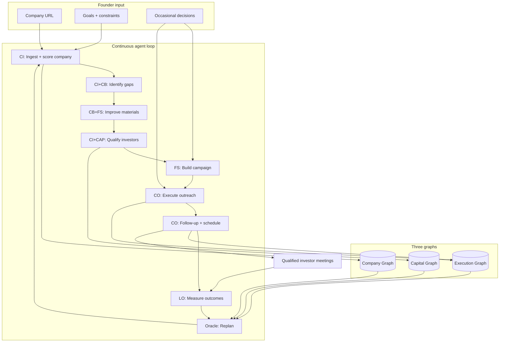
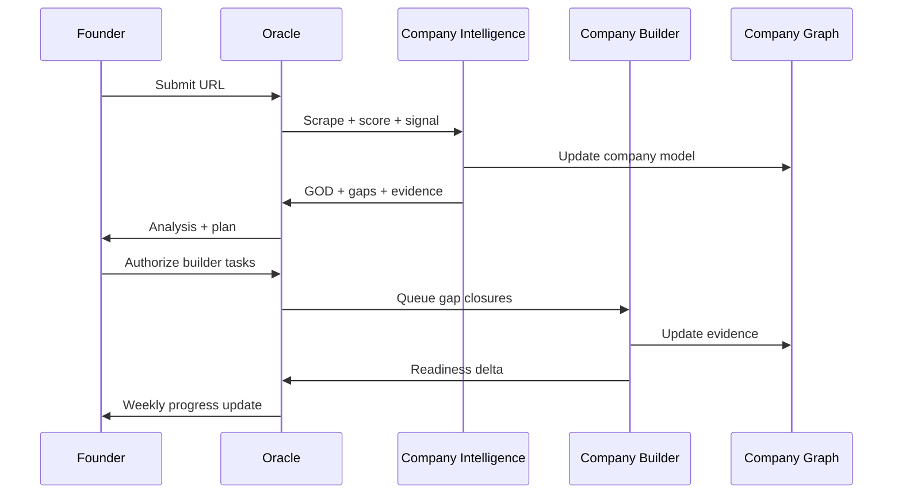
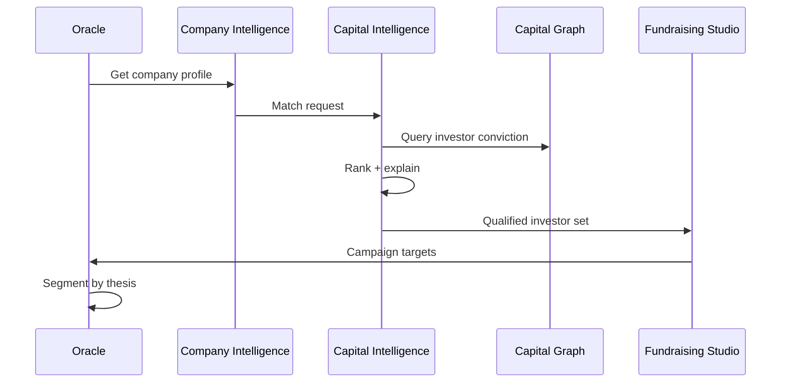
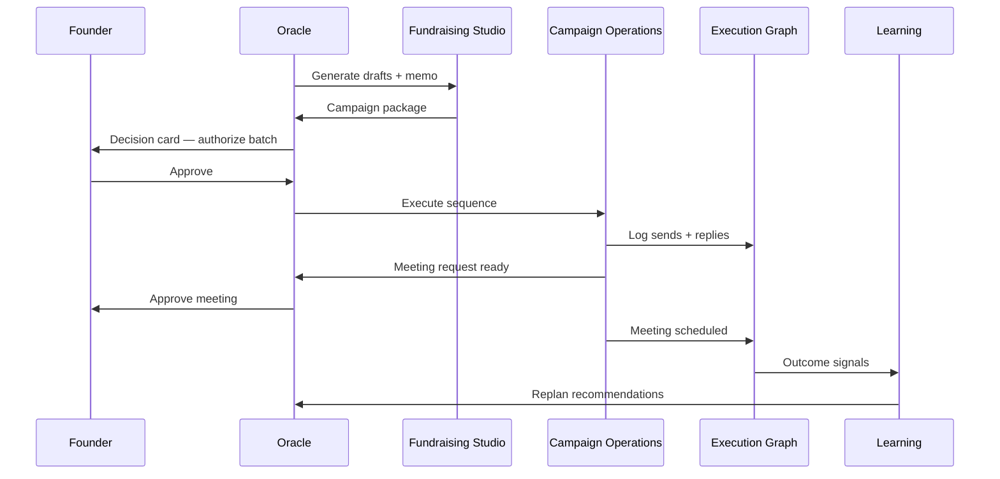
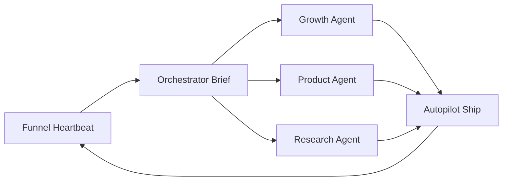
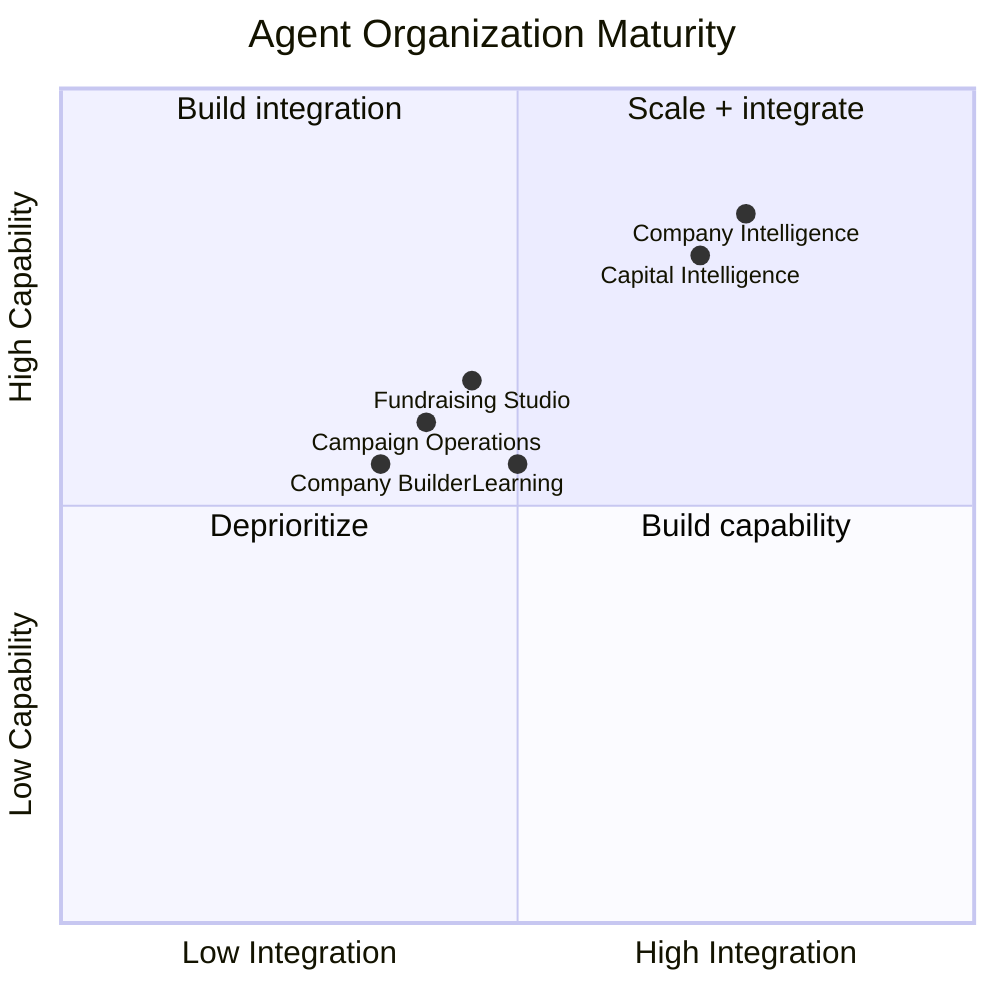
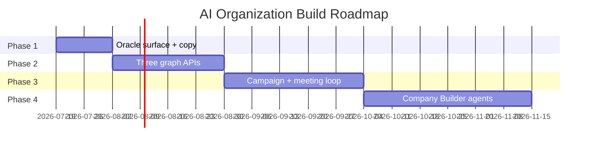

# Pythh AI Organization — Agent Map & Codebase

> **Companion to:** [PYTHH_VISION.md](./PYTHH_VISION.md)  
> **Purpose:** Map existing systems and agents to the six operating groups; define the agent loop graph; identify build gaps.  
> **Last updated:** 2026-07-18

---

## Organization model

Pythh is an **organization of AI agents**, not a single agent (Peter or PYTHIA alone).

---

## Agent loop graph (master)

The master loop connects all groups through the three graphs:

---

## Internal agent roster (current + planned)

### Tier 0 — Orchestrator

| Agent | Status | Path | Role |
|-------|--------|------|------|
| **Oracle** | Partial | `server/routes/oracle.js`, `server/lib/oracleMemoryStore.js` | Founder-facing strategy; needs unification with wizard |
| **Scout (Orchestrator)** | Exists | `agents/ORCHESTRATOR.md`, `scripts/orchestrator-brief.mjs`, `scripts/agents-autopilot.mjs` | Internal ops — funnel weakest-stage focus |

### Tier 1 — Specialist agents (by operating group)

#### 1. Company Intelligence

| Agent | Status | Implementation |
|-------|--------|----------------|
| URL Scraper | ✅ Exists | `server/services/urlScrapingService.ts`, `server/services/submitUrlIntelligence.js` |
| Signal Parser | ✅ Exists | `lib/signalParser.js`, `lib/signalOntology.js` |
| GOD Scorer | ✅ Exists | `server/services/startupScoringService.ts`, `server/routes/god.js` |
| Trajectory | ✅ Exists | `lib/trajectoryEngine.js` |
| Needs Inference | ✅ Exists | `lib/needsInference.js` |
| PYTHIA Collectors | ✅ Exists | `scripts/pythia/` (RSS, podcasts, LinkedIn) |
| Data Completeness | ✅ Exists | `server/services/dataCompletenessService.js` |
| Company Graph API | ❌ Missing | Data in `startup_uploads`, `pythh_entities`, `startup_signals` — no unified graph service |

#### 2. Company Builder

| Agent | Status | Implementation |
|-------|--------|----------------|
| Gap Analyst | ✅ Exists | `server/lib/gapTaskDerivation.js`, `server/routes/wizardRoute.js` |
| Task Planner | ✅ Exists | `server/lib/taskUnlockCatalog.js`, `founder_commitment_tasks` table |
| Proof Verifier | ✅ Partial | Wizard task complete → rescore; no automated proof validation |
| Advisor Finder | ❌ Missing | Vision spec only |
| Positioning Rewriter | ❌ Missing | Oracle coaching partial (`server/routes/oracle.js`) |
| Customer Pilot Builder | ❌ Missing | Vision spec only |
| Builder Orchestrator | ❌ Missing | Wizard + Oracle are parallel tracks, not unified |

#### 3. Capital Intelligence

| Agent | Status | Implementation |
|-------|--------|----------------|
| Investor Profiler | ✅ Exists | `scripts/pipeline-investor-intelligence.mjs`, `server/services/investorInferenceService.js` |
| Thesis Extractor | ✅ Exists | `investor_signal_events`, `vc_faith_signals` |
| Portfolio Signal | ✅ Exists | `server/lib/portfolioAnalytics.js`, `virtual_portfolio` |
| Match Ranker | ✅ Exists | `lib/matchEngine.js`, `server/services/investorMatching.ts` |
| Email Inference | ✅ Exists | `20260515120000_investor_email_inference.sql` |
| Timing Agent | ⚠️ Partial | Match engine timing dimension; no dedicated timing service |
| Capital Graph API | ❌ Missing | Fragmented across `investors`, `vc_intelligence`, `pythh_candidates` |

#### 4. Fundraising Studio

| Agent | Status | Implementation |
|-------|--------|----------------|
| Match Explainer | ✅ Exists | `site/components/MatchExplainBlock.tsx`, `lib/normalizeWhyYouMatch.js` |
| Investor Read | ✅ Exists | `server/lib/investorReadService.js`, `site/components/InvestorReadStep.tsx` |
| Outreach Drafter | ✅ Exists | `server/routes/outreachDraft.js`, `site/outreachRouter.ts` |
| Commitment Doc | ✅ Exists | `server/routes/wizardRoute.js` (document generation) |
| Narrative Agent | ⚠️ Partial | LLM prompts in outreach; no standalone narrative service |
| Deck Builder | ❌ Missing | Vision spec only |
| Segment Deck Variants | ❌ Missing | Vision spec only |
| Meeting Prep / Brief | ⚠️ Partial | UI in `Activate.tsx` demo; not fully backend-driven |
| Fundraising Studio workspace | ❌ Missing | Preview, wizard, drafts, pipeline are separate surfaces |

#### 5. Campaign Operations

| Agent | Status | Implementation |
|-------|--------|----------------|
| Outreach Agent (VC) | ✅ Exists | `scripts/outreach-agent.js`, `docs/OUTREACH_AGENT.md` |
| Peter Founder Outreach | ✅ Exists | `scripts/peter-founder-outreach.mjs`, `lib/pythiaVoice.js` |
| Peter Intro Concierge | ✅ Exists | `server/lib/peterIntroConcierge.js`, `site/components/PeterIntroPanel.tsx` |
| Outreach Scheduler | ✅ Exists | `scripts/cron/outreach-scheduler.js` |
| Reply Handler | ⚠️ Partial | `pythh_outreach_replies` table; no full classifier agent |
| Segmentation / Sequence | ❌ Missing | No campaign object model |
| Calendar / Scheduling | ⚠️ Partial | `site/components/MeetingScheduler.tsx` — UI only |
| PYTHIA Round Automation | ⚠️ Partial | `site/components/wizard/RoundAutomation.tsx`, wizard activate-round |
| Campaign Orchestrator | ❌ Missing | Scripts are siloed; no unified control plane |

#### 6. Learning & Optimization

| Agent | Status | Implementation |
|-------|--------|----------------|
| Growth Agent | ✅ Exists | `scripts/growth-agent-loop.mjs`, `agents/growth/` |
| Product Agent | ✅ Exists | `scripts/product-agent-loop.mjs`, `agents/product/` |
| Research Agent | ✅ Exists | `scripts/research-agent-loop.mjs`, `agents/research/` |
| Funnel Heartbeat | ✅ Exists | `scripts/funnel-heartbeat-probe.mjs`, `server/lib/funnelTelemetry.js` |
| Match Feedback Trainer | ⚠️ Partial | `scripts/train-match-feedback-baseline.js` — offline only |
| GOD Audit | ✅ Exists | `scripts/god-score-audit.js` |
| Campaign Analyst | ❌ Missing | No closed loop from outreach → match weights |
| Unified Experiment Registry | ❌ Missing | Growth, product, research registries separate |
| Learning → Engine feedback | ❌ Missing | Agents ship UX; engines not auto-tuned |

---

## Agent interaction loops (detailed)

### Loop A — Company readiness

**Code path today:** URL → `instantSubmit` → GOD → `wizardRoute/gaps` → gap cards → task ack/skip → rescore (partial).

---

### Loop B — Capital matching

**Code path today:** `lib/matchEngine.js` → `startup_investor_matches` → preview UI → explain blocks.

---

### Loop C — Campaign execution

**Code path today:** `outreachDraft.js` → `outreach-agent.js` / Peter scripts → demo meeting UI in Activate (not fully wired).

---

### Loop D — Internal optimization (existing)

**Code path today:** `.github/workflows/agents-autopilot-daily.yml` → `scripts/agents-autopilot.mjs`.

**Gap:** Optimizes signup funnel, not meeting outcomes. Must align with [PYTHH_VISION.md](./PYTHH_VISION.md) metric hierarchy.

---

## Three graphs — data store mapping

### Company Graph

| Node / edge | Primary tables | Service paths |
|-------------|----------------|---------------|
| Company | `startup_uploads` | `instantSubmit`, `urlScrapingService` |
| Signals | `startup_signals`, `pythh_signal_events` | `signalParser`, `scripts/pythia/` |
| Trajectories | `pythh_trajectories` | `trajectoryEngine.js` |
| Needs | `pythh_entity_needs` | `needsInference.js` |
| Scores | GOD columns, `score_snapshots_v2` | `startupScoringService.ts` |
| Gaps | Derived + `founder_commitment_tasks` | `gapTaskDerivation.js` |
| Evidence | `evidence_artifacts_v2` | Verification v2 migration |

**Build:** `GET /api/graph/company/:startupId` — unified query layer.

---

### Capital Graph

| Node / edge | Primary tables | Service paths |
|-------------|----------------|---------------|
| Investor | `investors` | `investors.js`, `investorLookupService` |
| Thesis | `investor_signal_events`, `vc_faith_signals` | `pipeline-investor-intelligence.mjs` |
| Portfolio | `virtual_portfolio`, `portfolio_events` | `portfolioAnalytics.js` |
| Conviction | `vc_intelligence`, match scores | `matchEngine.js` |
| Contacts | `investor_outreach`, email inference cols | `outreachDraft.js` |
| Timing | Partial — match timing dimension | `lib/matchEngine.js` |

**Build:** `GET /api/graph/capital/:investorId` + `POST /api/graph/capital/match/:startupId`.

---

### Execution Graph

| Node / edge | Primary tables | Service paths |
|-------------|----------------|---------------|
| Campaign | ❌ no table yet | — |
| Message | `investor_outreach`, `pythh_outreach_emails` | `outreachDraft.js`, `outreach-agent.js` |
| Reply | `pythh_outreach_replies` | `outreachWebhook.js` |
| Wizard task | `founder_commitment_tasks` | `wizardRoute.js` |
| Funnel event | `ai_logs` | `funnelTelemetry.js` |
| Meeting | ❌ no table yet | Activate UI demo only |
| Agent run | `growth_agent_runs`, `product_agent_runs` | agent loops |
| Decision | ❌ no table yet | Oracle UX spec |

**Build:** `execution_campaigns`, `execution_meetings`, `oracle_decisions` tables + `GET /api/graph/execution/:startupId`.

---

## Maturity matrix

| Operating group | Maturity | Headline gap |
|-----------------|----------|--------------|
| **Company Intelligence** | 🟢 Strong | Unified Company Graph API |
| **Company Builder** | 🟡 Partial | Advisor/positioning agents; unified orchestrator |
| **Capital Intelligence** | 🟢 Strong | Unified Capital Graph API; timing agent |
| **Fundraising Studio** | 🟡 Partial | Deck builder; single workspace |
| **Campaign Operations** | 🟡 Partial | Campaign orchestrator; reply classifier; real scheduling |
| **Learning & Optimization** | 🟡 Partial | Close loop into engines; meeting metrics |

---

## Build roadmap (agent organization)

### Phase 1 — Unify the Oracle surface (weeks 1–2)

- [ ] Oracle Analysis screen (preview reframe)
- [ ] Raise Plan screen (post-signup)
- [ ] Meeting funnel telemetry
- [ ] Copy pass per [PYTHH_FUNNEL_AUDIT.md](./PYTHH_FUNNEL_AUDIT.md)

### Phase 2 — Graph foundations (weeks 3–6)

- [ ] Company Graph read API
- [ ] Capital Graph read API
- [ ] Execution Graph schema (`campaigns`, `meetings`, `decisions`)
- [ ] Oracle reads all three for plan generation

### Phase 3 — Close the execution loop (weeks 7–12)

- [ ] Campaign Orchestrator agent (unify outreach scripts)
- [ ] Reply Classifier agent
- [ ] Decision card system
- [ ] Meeting pipeline (real, not demo)
- [ ] Learning agent feeds match/GOD weights

### Phase 4 — Company Builder expansion (weeks 13+)

- [ ] Advisor Finder agent
- [ ] Positioning Agent
- [ ] Deck Builder agent (segment variants)
- [ ] Customer Pilot Builder agent

---

## Persona clarification (engineering)

From `lib/pythiaVoice.js`:

| Name | Layer | Audience |
|------|-------|----------|
| **Oracle** | Product relationship + strategy | Founder |
| **PYTHIA** | In-app execution engine | Founder (named in updates) |
| **Peter** | Outbound human voice | External (investors, founders in email) |
| **Scout** | Internal orchestrator | Engineering/ops agents |

Do not conflate Oracle (founder partner) with Oracle tier (pricing) or Oracle scoreboard (portfolio marketing). Long-term: **Oracle** is both the relationship and the paid autonomy tier.

---

## Key file index (quick reference)

| Group | Start here |
|-------|------------|
| Company Intelligence | `server/services/startupScoringService.ts`, `lib/signalParser.js`, `PYTHH_PLATFORM.md` |
| Company Builder | `server/routes/wizardRoute.js`, `site/pages/Wizard.tsx` |
| Capital Intelligence | `lib/matchEngine.js`, `scripts/pipeline-investor-intelligence.mjs` |
| Fundraising Studio | `server/routes/outreachDraft.js`, `server/routes/previewRoute.js` |
| Campaign Operations | `scripts/outreach-agent.js`, `scripts/peter-founder-outreach.mjs` |
| Learning | `scripts/agents-autopilot.mjs`, `agents/growth/`, `server/lib/funnelTelemetry.js` |
| Oracle (strategy) | `server/routes/oracle.js`, `docs/PYTHH_ORACLE_UX.md` |
| Internal orchestrator | `agents/ORCHESTRATOR.md`, `scripts/orchestrator-brief.mjs` |

---

## Related documents

| Document | Purpose |
|----------|---------|
| [PYTHH_VISION.md](./PYTHH_VISION.md) | Product north star |
| [PYTHH_FUNNEL_AUDIT.md](./PYTHH_FUNNEL_AUDIT.md) | Current funnel vs vision |
| [PYTHH_ORACLE_UX.md](./PYTHH_ORACLE_UX.md) | Founder experience spec |
| `agents/ORCHESTRATOR.md` | Internal agent ops (needs metric realignment) |
| `agents/north-star.json` | Current north star (needs meeting outcome) |

---

*This document should be updated when new agents ship or graph APIs land.*
