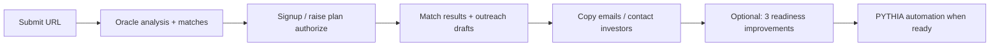
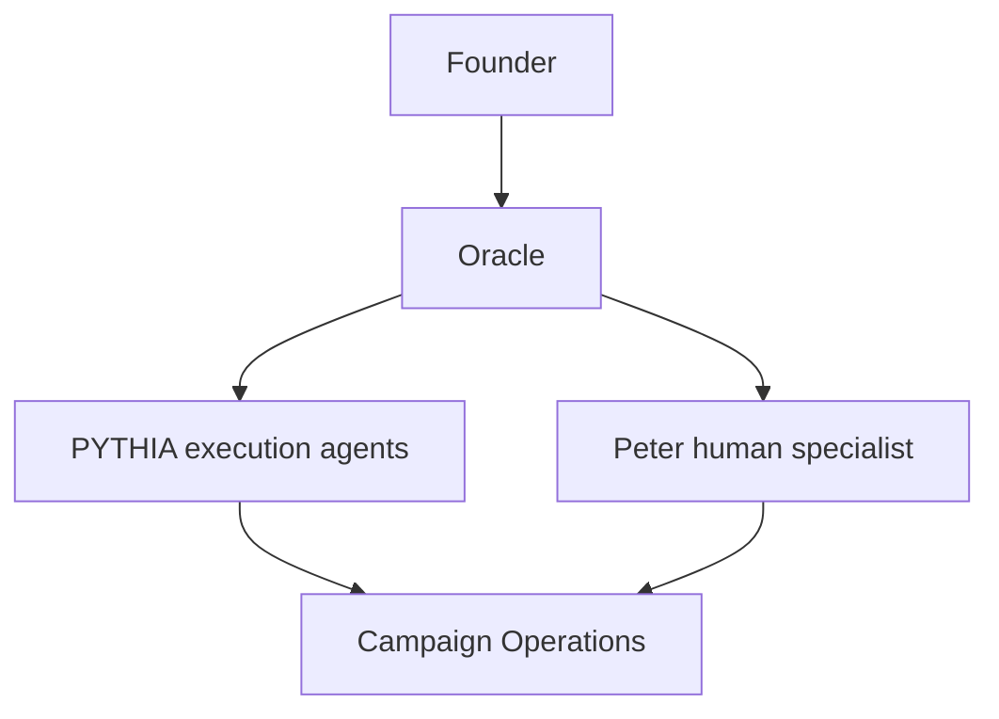
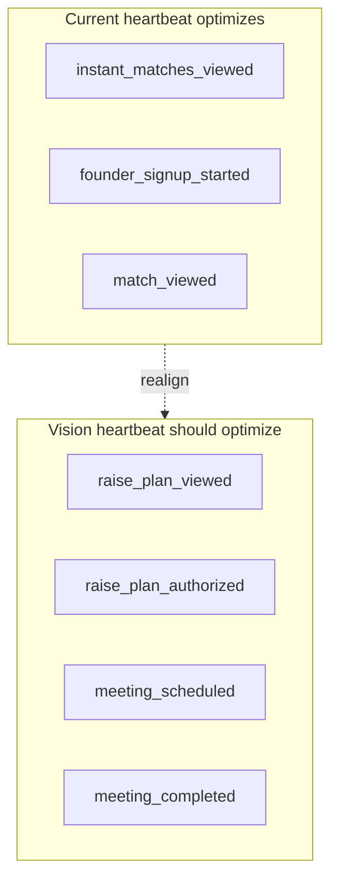
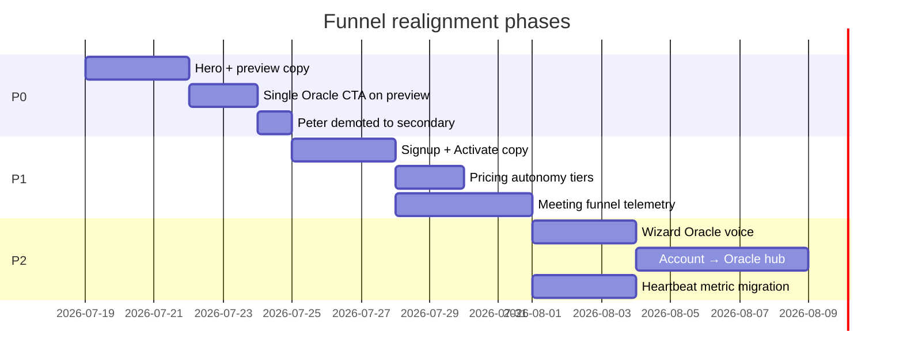

# Pythh Founder Funnel Audit

> **Against:** [PYTHH_VISION.md](./PYTHH_VISION.md) — meetings-first, Oracle-centric, continuous loop.  
> **Scope:** `site/` founder funnel (pythh.ai production app).  
> **Last updated:** 2026-07-18

---

## Executive summary

**2026-07-18 P0 — Unlock gauntlet regression:** Post-signup founders hit up to **12 mandatory-feeling “unlock” cards** before outreach, with unexplained GOD score jargon and no input fields on the card itself (deadline modal ≠ task completion). Outreach was **hard-gated** behind readiness score + 2 commitments. **Fix shipped:** outreach drafts always visible when matches exist; wizard defaults to **Outreach tab**; max **3 optional** readiness cards per session; GOD score explained in plain language.

The live funnel **splits identity** between two products:

| Layer | Current frame | Vision frame |
|-------|---------------|--------------|
| Acquisition (Home, Matches, preview) | **Match list** — shortlist, thesis fit, ranked investors | **Raise plan** — readiness, gaps, qualified path to meetings |
| Signup gate | Save matches, track movement | Authorize Oracle to run the raise |
| Activation (Activate, Wizard) | GOD score + unlocks + locked outreach | Continuous autonomous loop toward meetings |
| Paid (Oracle tier) | Pipeline automation + meetings | Primary outcome already stated — undermined by upstream copy |
| Telemetry | Celebrates `instant_matches_viewed` | Should celebrate meetings pipeline stages |

**Gap severity:** ~~High~~ Medium after P0 unlock fix — copy/metrics still need work; outreach no longer blocked by 12-card parade.

### Correct funnel (after fix)

| Step | User should understand | Was broken |
|------|------------------------|------------|
| GOD score | Investor readiness 0–100 | Unlabeled jargon |
| Unlock card | Optional deadline + later proof | Felt mandatory; 12 cards; no proof field on card |
| Outreach | Available with matches | Locked behind readiness bar |
| PYTHIA | Paid automation, optional | Confused with unlock subscription |

```mermaid
flowchart LR
  subgraph TODAY["Current funnel promise"]
    T1[URL] --> T2[Matches]
    T2 --> T3[Signup]
    T3 --> T4[Unlocks]
    T4 --> T5[Locked outreach]
  end

  subgraph TARGET["Vision funnel promise"]
    V1[URL] --> V2[Oracle analysis]
    V2 --> V3[Raise plan]
    V3 --> V4[Authorize]
    V4 --> V5[Meetings]
  end

  style TODAY fill:#1a1a2e
  style TARGET fill:#0f2a1a
```

---

## Route inventory

| Route | File | Current role | Vision-aligned role |
|-------|------|--------------|---------------------|
| `/` | `site/Home.tsx` | Hero → match preview | Hero → Oracle analysis → raise plan teaser |
| `/matches` | `site/pages/Matches.tsx` | Match dashboard | Oracle command center (plan + progress) |
| `/matches?url=` | `site/components/InstantMatchPreview.tsx` | Shortlist reveal + signup gate | Analysis reveal + authorization gate |
| `/signup/founder` | `site/pages/FounderSignup.tsx` | Save shortlist | Start autonomous raise |
| `/activate` | `site/Activate.tsx` | Scan → results → pipeline demo | Oracle onboarding + first weekly update |
| `/wizard/:id` | `site/pages/Wizard.tsx` | Act 2/3 unlocks + round tab | Company Builder + Campaign Ops (subset of loop) |
| `/pricing` | `site/Pricing.tsx` | Scout / Oracle / Pantheon | Autonomy tiers (Observe / Prepare / Execute) |
| `/account` | `site/Account.tsx` | Billing + PYTHIA history | Oracle relationship hub |
| `/oracle` | `site/pages/Oracle.tsx` | Education page | Should merge into primary Oracle UX |

---

## Screen-by-screen audit

### 1. Home (`site/Home.tsx`)

| Element | Current copy | Issue | Recommended direction |
|---------|--------------|-------|----------------------|
| Hero H1 | "Find investors that match your thesis." | Match-first | "You build the company. Pythh runs the raise." |
| Hero sub | "Submit your URL… matches you to top investors and automates your funding round." | Half right — "automates round" good; "matches" leads | "Enter your URL. Oracle analyzes readiness, finds fit investors, and runs outreach toward meetings." |
| Social proof | "{N}+ investor matches" | Vanity metric | "{N} meetings scheduled" or "GOD readiness improved +{avg}" |
| PYTHIA section | "booking confirmed meetings" | ✅ Aligned | Make this the **hero**, not mid-page |
| Footer CTA | "Match preview" | Match-first | "Start your raise" |

**Priority:** P0 — first impression defines category.

---

### 2. Matches landing (`site/pages/Matches.tsx`)

| Element | Current copy | Issue | Recommended |
|---------|--------------|-------|-------------|
| H1 | "Find investors that match your startup" | Match-first | "See your fundraising plan" |
| Sub | "ranked investor shortlist… Save, request intros, or export" | List output | "Oracle analyzed your company. Here's what's missing, who fits, and what happens next." |
| CTA | "Preview my matches" | Match-first | "Analyze my company" or "See my raise plan" |
| Footer stat | "matches in network" | Vanity | "investors qualified this week" |

**Priority:** P0

---

### 3. Instant match preview (`site/components/InstantMatchPreview.tsx`)

| Element | Current copy | Issue | Recommended |
|---------|--------------|-------|-------------|
| Primary CTA | "Create free account — see all {N} matches" | Output = list | "Create account — start your raise" |
| Gate CTAs | "Track shortlist", "Ask Peter", "Export & track" | Fragmented actions | Single green CTA: "Authorize Oracle plan" |
| Oracle gap teaser | GOD gap cliffhanger | ✅ Good hook | Reframe as "what Oracle will fix before outreach" |
| Footer | "ask Peter for thesis framing" | Peter ≠ Oracle | "Oracle handles positioning — Peter available for human review" |
| Hidden matches | "+{N} more matches unlock after signup" | List tease | "+{N} investors in your qualified pipeline after signup" |

**Priority:** P0 — highest-traffic conversion surface.

---

### 4. Founder signup (`site/pages/FounderSignup.tsx`)

| Element | Current copy | Issue | Recommended |
|---------|--------------|-------|-------------|
| Headline | "Start tracking your investors" | CRM frame | "Start your autonomous raise" |
| Sub | "shortlist is ready… save matches, watch movement, queue intros" | Match CRM | "Oracle has your analysis. One email to authorize the plan and begin." |
| Bullets | Track shortlist / movement alerts / intro pipeline | Match-centric | Readiness plan / qualified investors / meeting pipeline |

**Priority:** P1

---

### 5. Activate (`site/Activate.tsx`)

| Element | Current copy | Issue | Recommended |
|---------|--------------|-------|-------------|
| Entry H1 | "Where should I start?" | Generic | "Oracle, analyze my company" |
| Scan label | "Preparing match report" | Match output | "Building your raise plan" |
| Results header | "{N} investors ranked for {startup}" | List headline | "{N} investors qualified · {readiness}% raise-ready" |
| Pipeline CTA | "PYTHIA reaches out… meetings booked. You approve." | ✅ Aligned | Lead with this; demote raw match list |
| Per-investor actions | "Request intro", "Mark contacted" | Manual CRM | "Approve outreach" / "View in campaign" |
| Meeting UI | "Approve Meeting", "Pre-meeting brief" | ✅ Aligned | Instrument + make primary success state |

**Priority:** P1 — structure is closer to vision; copy needs shift.

---

### 6. Wizard (`site/pages/Wizard.tsx`)

| Element | Current copy | Issue | Recommended |
|---------|--------------|-------|-------------|
| Act 2 framing | "Choose your unlocks" | Checkbox gamification | "Oracle identified {N} readiness gaps blocking meetings" |
| Progress | "GOD {score}/100" | Score vanity | "Readiness for outreach: {score} · {N} meetings unlocked at {threshold}" |
| Round tab | "Outreach package locked" | ✅ Good gate | Tie lock explicitly to meeting threshold |
| Commitments tab | "X/Y unlocks proved" | Task count | "X/Y gaps closed · +{pts} meeting probability" |

**Priority:** P2 — mechanics are Company Builder; framing needs Oracle voice.

---

### 7. Pricing (`site/Pricing.tsx`)

| Element | Current copy | Issue | Recommended |
|---------|--------------|-------|-------------|
| Scout (free) | "3 searches. See who fits." | Match search | "Observe — Oracle analyzes, recommends" |
| Oracle (paid) | "Full pipeline automation" | ✅ Good | Map to Prepare + Execute tiers explicitly |
| Scout CTA | "Preview matches" | Match-first | "Analyze my company" |
| Oracle features | Meeting approval, pre-meeting brief | ✅ Aligned | Lead feature list with "Qualified investor meetings" |

**Priority:** P1 — align tier names with autonomy model (see Oracle UX doc).

---

### 8. Peter vs Oracle vs PYTHIA (naming)

| Persona | Current role | Vision role |
|---------|--------------|-------------|
| **Oracle** | Paid plan name + scoreboard + gap teaser | **Primary founder relationship** — strategy, authorization, updates |
| **PYTHIA** | AI agent in Activate/outreach | **Execution engine** under Oracle (Campaign Operations) |
| **Peter** | Human intro concierge | **Specialist** — high-touch intro framing, escalations |

**Issue:** Three names compete at preview/signup. Founder should meet **Oracle** first; PYTHIA and Peter are named when relevant ("PYTHIA sent 30 messages", "Peter reviewed your intro").

**Priority:** P0 for preview/signup surfaces.

---

## Telemetry audit

### Current funnel operations (`server/lib/funnelTelemetry.js`)

**Match-centric (over-weighted):**

| Event | Required in heartbeat? | Vision alignment |
|-------|------------------------|------------------|
| `instant_matches_viewed` | ✅ Yes | Demote — supporting metric |
| `match_viewed` | ✅ Yes | Supporting |
| `match_intro_requested` | Optional | Supporting — not primary outcome |
| `wizard_unlock_flow_started` | ✅ Yes | Supporting — readiness step |

**Meeting-centric (missing entirely):**

| Event needed | When fired |
|--------------|------------|
| `raise_plan_viewed` | Oracle presents plan after URL |
| `raise_plan_authorized` | Founder approves campaign |
| `outreach_authorized` | Execute-level approval |
| `outreach_message_sent` | Campaign Operations |
| `investor_reply_received` | Reply classification |
| `meeting_request_ready` | Investor says yes |
| `meeting_approved` | Founder approves meeting |
| `meeting_scheduled` | Calendar confirmed |
| `meeting_brief_viewed` | Pre-meeting prep |
| `meeting_completed` | Post-meeting (future) |

### Growth experiments (`agents/growth/experiment-registry.json`)

Primary metric today: `founder_signup_started`  
Secondary: `match_intro_requested`

**Recommended primary (post-reposition):** `raise_plan_authorized` or `founder_signup_started` with copy testing toward authorization, not match save.

### North star (`agents/north-star.json`)

Current: "100 signups/day"  
Vision addition: "qualified investor meetings per active raise per month"

---

## Copy realignment matrix

| Funnel stage | ❌ Stop saying | ✅ Start saying |
|--------------|---------------|-----------------|
| Hero | Find investors that match | You build the company. Pythh runs the raise. |
| Preview | See all matches / shortlist | Your raise plan / qualified pipeline |
| Signup | Save matches / track shortlist | Authorize Oracle / start your raise |
| Results | {N} investors ranked | {N} investors qualified · {M} meetings target |
| Wizard | Choose unlocks / GOD points | Close gaps blocking meetings |
| Round | Go back to unlocks | Improve readiness to unlock outreach |
| Pricing | Preview matches | Analyze (Observe) / Run raise (Execute) |
| Success | Matches saved | Oracle is running your campaign |

---

## Recommended implementation order

---

## Files to change (implementation checklist)

| Priority | File | Change type |
|----------|------|-------------|
| P0 | `site/Home.tsx` | Hero, social proof, CTA |
| P0 | `site/pages/Matches.tsx` | H1, sub, CTA |
| P0 | `site/components/InstantMatchPreview.tsx` | Primary CTA, footer |
| P0 | `site/lib/heroHeadlineExperiment.ts` | Experiment variants |
| P1 | `site/pages/FounderSignup.tsx` | Headline, bullets |
| P1 | `site/Activate.tsx` | Scan labels, results header |
| P1 | `site/Pricing.tsx` | Tier framing |
| P1 | `server/lib/funnelTelemetry.js` | Meeting events |
| P2 | `site/pages/Wizard.tsx` | Act 2/3 copy |
| P2 | `site/Account.tsx` | Oracle hub framing |
| P2 | `agents/north-star.json` | Metric hierarchy |
| P2 | `agents/growth/experiment-registry.json` | Primary metrics |

---

*See also: [PYTHH_ORACLE_UX.md](./PYTHH_ORACLE_UX.md) for the target experience design.*
