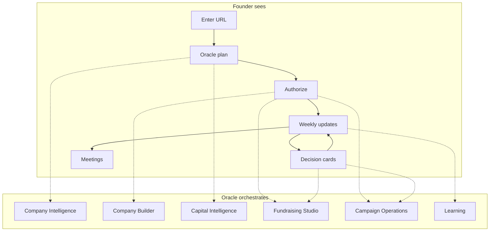
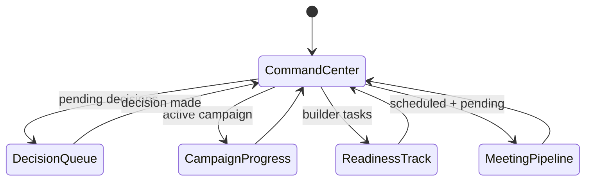
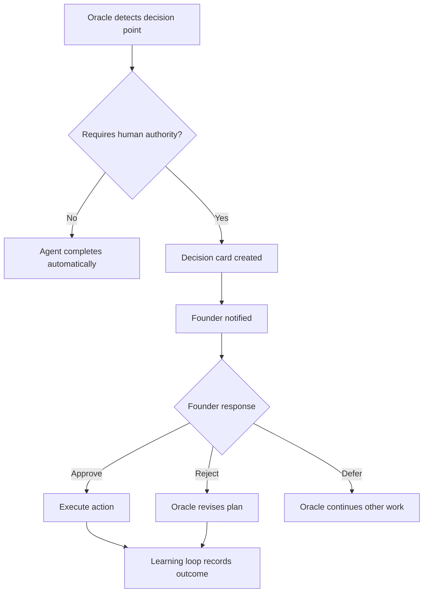
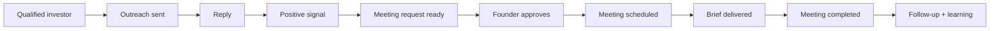
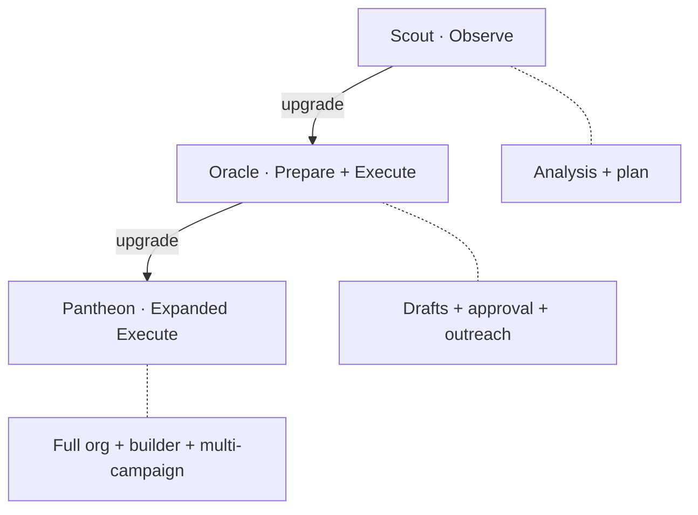
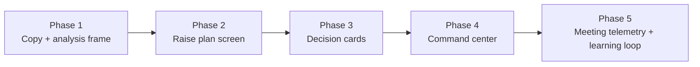

# Pythh Oracle UX — Founder Experience Spec

> **Companion to:** [PYTHH_VISION.md](./PYTHH_VISION.md)  
> **Replaces:** fragmented PYTHIA/Peter/match-preview as the primary founder relationship.  
> **Last updated:** 2026-07-18

---

## Design principle

The founder sees **one relationship — with the Oracle**.

Underneath: six operating groups, dozens of specialist agents, three graphs.  
On the surface: URL in → plan out → authorize → weekly updates → decision cards → meetings.



---

## Persona hierarchy (founder-facing)

| Name | When founder hears it | Role |
|------|----------------------|------|
| **Oracle** | Always — primary voice | Strategy, plan, authorization, updates, decisions |
| **PYTHIA** | During execution | "PYTHIA prepared 30 messages" / "PYTHIA identified 4 warm paths" |
| **Peter** | Optional escalation | "Peter reviewed your intro draft" — human specialist, not default CTA |

---

## Phase 1 — First interaction (URL → Oracle analysis)

### Entry points

- Home hero URL submit → `/matches?url=`
- `/find-investors`, `/activate`, shared links

### Screen: Oracle Analysis (replaces "match preview" framing)

**Layout:**

```
┌─────────────────────────────────────────────────────────┐
│  ORACLE · Initial analysis                              │
├─────────────────────────────────────────────────────────┤
│  {Company name} · {sector} · {stage}                    │
│                                                         │
│  ┌─────────────┐  ┌─────────────┐  ┌─────────────┐     │
│  │ Readiness   │  │ Qualified   │  │ Top gap     │     │
│  │ {score}     │  │ {N} inv.    │  │ {headline}  │     │
│  └─────────────┘  └─────────────┘  └─────────────┘     │
│                                                         │
│  WHAT ORACLE UNDERSTANDS                                │
│  • {bullet — product/market}                            │
│  • {bullet — team/traction}                             │
│  • {bullet — positioning}                               │
│                                                         │
│  WHAT'S BLOCKING MEETINGS                               │
│  • {gap 1 — partner objection}                          │
│  • {gap 2}                                              │
│  • {gap 3 — blurred beyond signup}                      │
│                                                         │
│  RECOMMENDED PLAN (summary)                             │
│  {12-week seed campaign · {N} investors · 3 fixes first}│
│                                                         │
│  [ Start my raise — free account ]   [ Ask Oracle more ]│
└─────────────────────────────────────────────────────────┘
```

**Oracle voice (example):**

> We analyzed {Company}, your market, team signals, and {N} investors in our capital graph. You're {readiness}% raise-ready. The biggest thing blocking partner meetings is {top gap}. Before outreach, I recommend {2 fixes}. Then we can run a {duration} campaign targeting {segments}.

**Data sources (existing):**

- `GET /api/instant/submit` → startup + matches
- `GET /api/wizard/:id/gaps` → readiness gaps + unlock summary
- `buildInvestorReadPayload` → partner psychology mirror
- GOD score components

**Telemetry:** `raise_plan_viewed`, `oracle_analysis_completed`

---

## Phase 2 — Signup → Authorization

### Screen: Authorize your raise (replaces "save shortlist")

```
┌─────────────────────────────────────────────────────────┐
│  Start your raise                                       │
├─────────────────────────────────────────────────────────┤
│  Oracle has your analysis saved. Enter email to:        │
│  ✓ Activate your raise plan                             │
│  ✓ Track readiness improvements                       │
│  ✓ Authorize outreach when you're ready                 │
│                                                         │
│  [ email ]                                              │
│  [ Start my raise → ]                                   │
└─────────────────────────────────────────────────────────┘
```

Post-signup route: `/activate?startup_id={id}&welcome=1` (existing) → immediately show **full plan**, not re-scan.

**Telemetry:** `founder_signup_completed`, `raise_plan_authorized` (when explicit plan accept added)

---

## Phase 3 — Full raise plan (post-signup)

### Screen: Oracle Raise Plan

```
┌─────────────────────────────────────────────────────────┐
│  YOUR RAISE PLAN · {Company}                            │
├─────────────────────────────────────────────────────────┤
│  CAMPAIGN                                               │
│  Target: ${amount} {stage} · {duration} weeks           │
│  Segments: robotics, AI infra, enterprise automation    │
│  Qualified investors: 84 of 231 identified              │
│                                                         │
│  BEFORE OUTREACH (Company Builder)                      │
│  ☐ Strengthen customer proof        · +12 readiness     │
│  ☐ Revise category position         · +8 readiness      │
│  ☐ Add logistics advisor              · +15 readiness   │
│                                                         │
│  AUTONOMY LEVEL                                         │
│  ○ Observe — recommendations only                       │
│  ● Prepare — Oracle drafts, I approve (default)         │
│  ○ Execute — pre-authorized campaign (Oracle tier)      │
│                                                         │
│  [ Authorize plan ]        [ Adjust with Oracle ]        │
└─────────────────────────────────────────────────────────┘
```

**Authorization scopes (Execute mode example):**

> Contact up to 100 seed investors scoring ≥82, approved narrative v2, exclude {competitors} and prior contacts.

Store as `campaign_authorizations` (future table) — for now: session + account preference.

**Telemetry:** `raise_plan_authorized`, `autonomy_level_set`

---

## Phase 4 — Oracle Command Center (ongoing home)

Replace `/matches` empty state and `/account` for subscribed founders.

### Route: `/raise` or `/account` (Oracle hub)



### Command Center layout

```
┌─────────────────────────────────────────────────────────┐
│  ORACLE · {Company}                    Readiness: 67 ↑4 │
├──────────────┬──────────────────────────────────────────┤
│  This week   │  DECISIONS NEEDED (2)                    │
│  ─────────   │  ┌────────────────────────────────────┐  │
│  ✓ Reposition│  │ Approve deck v3                    │  │
│  ✓ 30 msgs   │  │ Authorize outreach group A (30)   │  │
│  ✓ 3 advisors│  └────────────────────────────────────┘  │
│  ◐ 4 warm    │                                          │
│    paths     │  MEETING PIPELINE                        │
│              │  ● Request ready — Sarah Chen, a16z      │
│  CAMPAIGN    │  ○ Scheduled — Mar 12, 2pm PT            │
│  30/84 sent  │  ○ Brief ready                           │
│  4 replies   │                                          │
│  1 meeting   │  [ View full pipeline ]                  │
└──────────────┴──────────────────────────────────────────┘
```

**Weekly update format (email + in-app):**

> **This week Oracle completed:**
> - {completed items}
>
> **Decisions needed:**
> - {decision cards}
>
> **Meeting pipeline:** {N} scheduled · {M} pending approval

---

## Phase 5 — Decision cards

Only surface decisions requiring **human authority**.



### Decision card types

| Type | Example | Default autonomy |
|------|---------|------------------|
| **Positioning** | "Approve category shift to Physical AI infra" | Prepare |
| **Deck** | "Approve deck v3 (slides 2,4,7 changed)" | Prepare |
| **Outreach batch** | "Authorize first 30 investors (group A)" | Prepare → Execute |
| **Intro accept** | "Accept warm intro via {mutual}" | Always ask |
| **Terms** | "Confirm raising $2M seed at $10M cap" | Always ask |
| **Advisor** | "Approve outreach to {name} as advisor" | Prepare |
| **Investor Q&A** | "Material question from {partner} — draft answer attached" | Always ask |

### Decision card UI

```
┌─────────────────────────────────────────────────────────┐
│  DECISION · Approve outreach group A                    │
├─────────────────────────────────────────────────────────┤
│  Oracle recommends contacting 30 investors in robotics/   │
│  AI infra. All score ≥82. Narrative: approved v2.       │
│                                                         │
│  Preview: [3 sample messages]                           │
│  Excludes: 12 competitors · 8 prior contacts            │
│                                                         │
│  [ Approve ]  [ Revise ]  [ Not now ]                   │
└─────────────────────────────────────────────────────────┘
```

**Telemetry:** `decision_card_viewed`, `decision_approved`, `decision_rejected`, `decision_deferred`

---

## Phase 6 — Meeting pipeline (primary outcome)

Meetings are the **success state**, not match list expansion.



### Meeting states (UI)

| State | Founder action | Oracle action |
|-------|----------------|---------------|
| **Request ready** | Approve / Decline | Prepared pitch brief |
| **Scheduled** | View brief / Add calendar | Sent pre-meeting brief 24h before |
| **Completed** | Optional debrief | Records objections → learning loop |
| **Declined** | — | Finds next best match |

**Telemetry:** `meeting_request_ready`, `meeting_approved`, `meeting_scheduled`, `meeting_brief_viewed`, `meeting_completed`

---

## Autonomy tiers (maps to Pricing)

| Tier | Product name | Autonomy | Founder experience |
|------|--------------|----------|-------------------|
| Free | **Scout** | Observe | Analysis + plan + recommendations |
| Paid | **Oracle** | Prepare + Execute | Drafts + authorized campaigns + meetings |
| Premium | **Pantheon** | Execute (expanded) | Multi-segment campaigns, advisor/customer builder, priority |



---

## Migration from current UX

| Current surface | Oracle UX equivalent | Migration notes |
|-----------------|---------------------|-----------------|
| `InstantMatchPreview` | Oracle Analysis | Reuse data; change frame + CTA |
| `FounderSignup` | Authorize raise | Copy + post-signup path |
| `Activate` results | Raise plan detail | Demote match list; elevate plan |
| `Wizard` gap cards | Company Builder queue | Oracle voice; same mechanics |
| `Wizard` round tab | Campaign Operations status | Outreach lock → meeting threshold |
| `Activate` pipeline demo | Meeting pipeline | Already closest — make real + instrument |
| `PeterIntroPanel` | Oracle chat / optional Peter | Demote from primary CTA |
| `/matches` | Command Center | Major redesign |

### Phased rollout



---

## Open design questions

1. **Route naming:** `/raise` vs `/account` vs `/oracle` for command center?
2. **Execute authorization storage:** DB table vs account settings JSON?
3. **Peter placement:** Oracle chat sidebar vs separate "Ask Peter" on intro decisions only?
4. **Investor list visibility:** Show qualified count without full list on free tier?

---

*See also: [PYTHH_FUNNEL_AUDIT.md](./PYTHH_FUNNEL_AUDIT.md) for current-state gaps, [PYTHH_AI_ORGANIZATION.md](./PYTHH_AI_ORGANIZATION.md) for agent mapping.*
