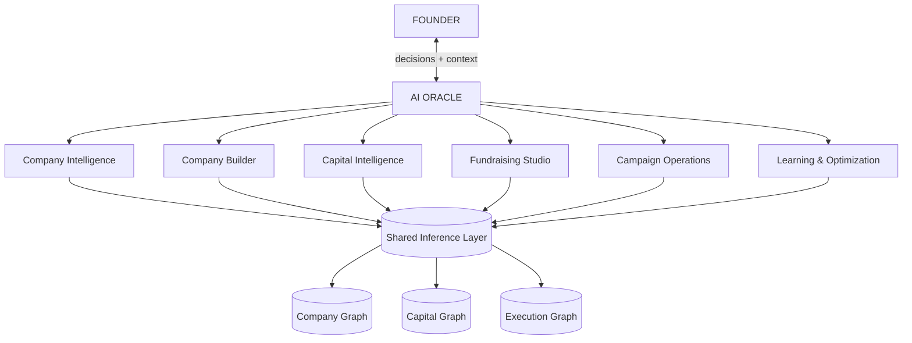
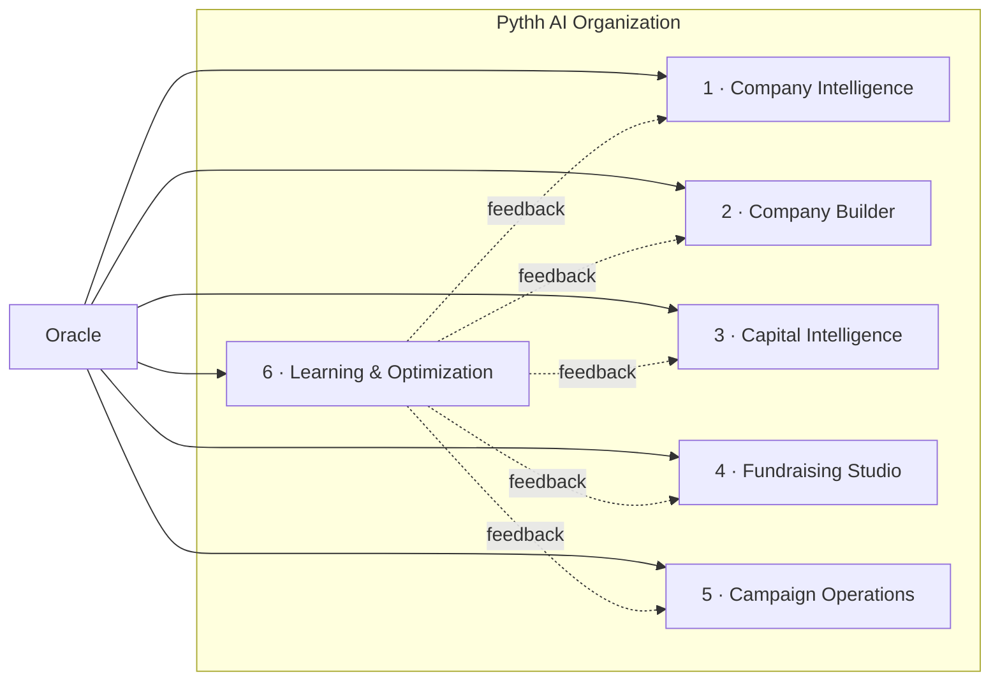
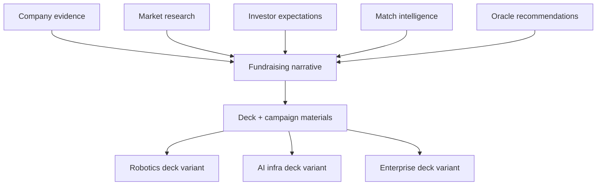
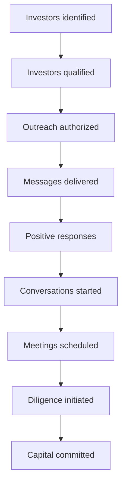
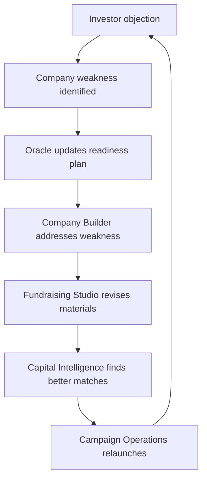
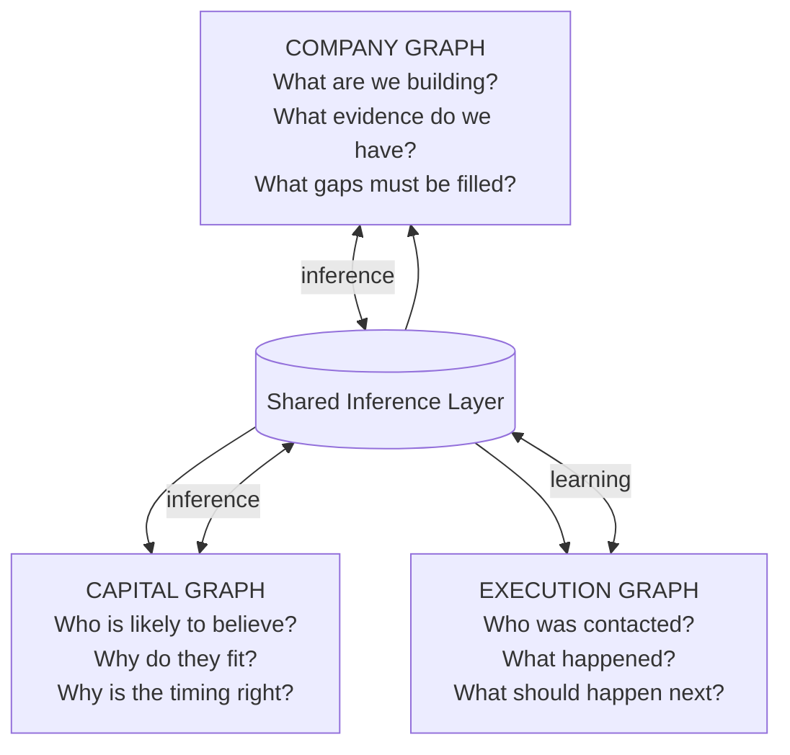
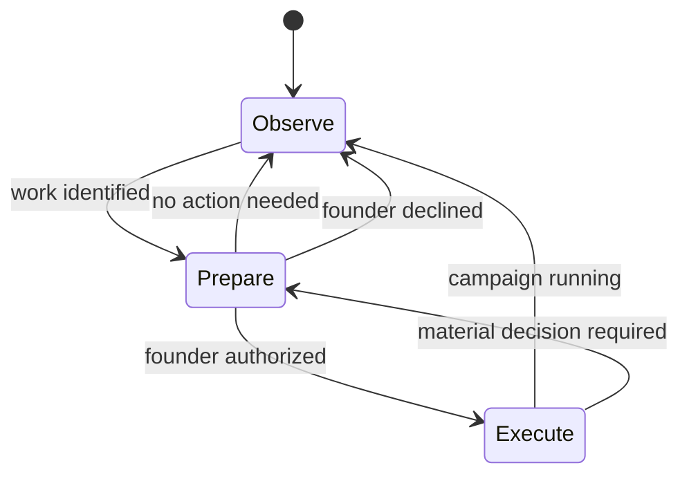
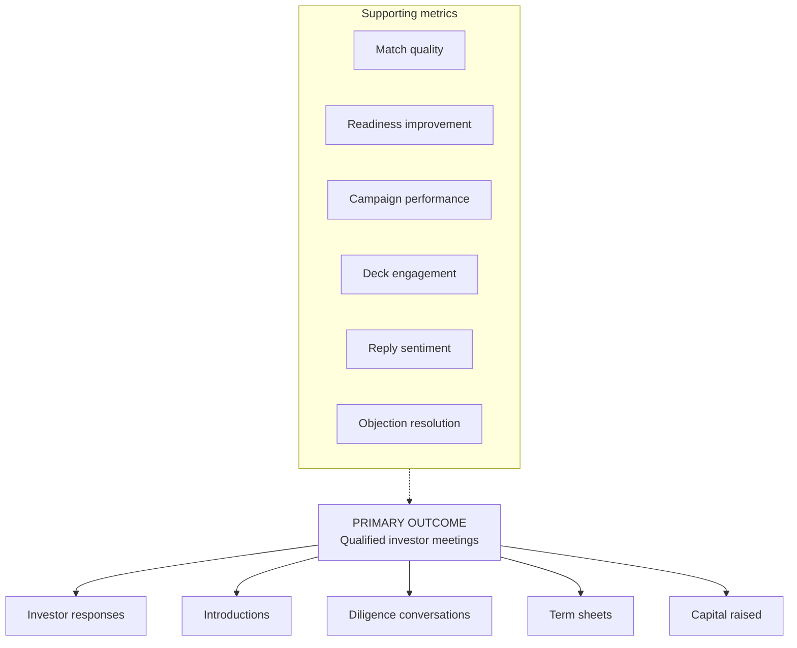

# Pythh Vision — Autonomous Capital Formation

> **Status:** Canonical product definition (founder-facing + internal).  
> **Supersedes for product narrative:** positioning that frames Pythh as an investor-matching platform or AI sales agent.  
> **Complements (does not replace):** `PYTHH_PLATFORM.md` (signal-intelligence engineering reference).

---

## What Pythh is

Pythh is **not** an investor-matching platform with an AI sales agent.

Pythh is an **autonomous fundraising organization** for founders.

The founder provides the company, goals, constraints, and occasional decisions. Pythh continuously runs the work required to:

- make the company more fundable
- identify the right investors
- create the campaign
- conduct outreach
- generate investor meetings

### Core promise

**You build the company. Pythh runs the fundraising process.**

Or more explicitly:

> Pythh finds your investors, strengthens your story, builds your campaign, conducts outreach, and schedules meetings — while continuously improving your company's fundraising readiness.

### Primary output

The output is **not** a list of investors.

The output is:

**Qualified investor meetings.**

---

## The Autonomous Fundraising Loop

This loop runs **continuously**, not as a one-time wizard the founder must restart when something changes.

```mermaid
flowchart TB
  subgraph LOOP["Autonomous Fundraising Loop"]
    A[Understand the startup] --> B[Identify readiness gaps]
    B --> C[Improve positioning and materials]
    C --> D[Find matching investors]
    D --> E[Develop fundraising strategy]
    E --> F[Create personalized campaigns]
    F --> G[Conduct outreach]
    G --> H[Manage follow-up]
    H --> I[Schedule investor meetings]
    I --> J[Learn from investor responses]
    J --> K[Improve startup and campaign]
    K --> L[Find better matches]
    L --> A
  end

  style LOOP fill:none,stroke:#22c55e
```

Pythh monitors the company, market, investor behavior, outreach results, and fundraising progress — then determines **what should happen next** without requiring the founder to restart the process.

---

## The AI Oracle

The Oracle is the **strategic intelligence at the center** of Pythh.

It is not a chatbot or generic founder assistant. It is the founder's **AI fundraising partner and chief strategy officer**.

### Oracle responsibilities

| Responsibility | Description |
|----------------|-------------|
| Understand | Startup, market, stage, constraints |
| Assess readiness | Is this company ready to raise now? |
| Prioritize weaknesses | What matters most for fundability? |
| Set strategy | Raise size, narrative, investor segments, timing |
| Direct agents | Route work to specialist AI systems |
| Review results | Change plan based on evidence |
| Escalate decisions | Surface only what requires human authority |
| Persist | Continue working when the founder does not respond |

The founder experiences **one relationship — with the Oracle** — even though many specialized systems operate beneath it.

### Founder decisions (human authority required)

The Oracle asks the founder only for decisions that truly require human authority:

- approve a major positioning change
- authorize outreach
- confirm fundraising terms
- approve a deck
- accept an introduction
- approve a new team member or advisor
- respond to material investor questions

Everything else should be **prepared or completed automatically**.

---

## The Pythh AI Organization

Six operating groups — not dozens of loosely related agents.

### 1. Company Intelligence

Understands the startup. Produces a **living Company Graph**, not a static profile.

**Analyzes:** website/product, team, market, competitors, differentiation, business model, traction, customer proof, technology, fundraising history, investor readiness.

**Output:** what is missing, contradictory, weak, or unproven.

### 2. Company Builder

When the Oracle identifies a gap, the Company Builder **works to close it** — not just score it.

Examples:

| Gap | Builder actions |
|-----|-----------------|
| Weak enterprise credibility | Find advisors → rank → prepare outreach → advisor campaign |
| No customer validation | Identify early customers → target list → pilot proposition → outreach |
| Weak positioning | Market research → competitor analysis → category rewrite → new narrative |

This is what makes Pythh different from investor databases: it **actively makes startups more fundable**.

### 3. Capital Intelligence

Builds and maintains the **Capital Graph** — dynamic investor conviction, not declared criteria alone.

**Models:** fund, partners, thesis, stage, check size, geography, sector, portfolio, recent behavior, conviction signals, relationship paths, timing, likelihood of engagement.

**Signal sources:** investments, partner writing, podcasts, public statements, hiring, fund announcements, portfolio patterns, exits, thesis changes, market activity, responses to prior Pythh campaigns.

### 4. Fundraising Studio

Creates everything the startup needs for the raise:

- fundraising strategy, target raise, use of funds
- recommended narrative and category positioning
- investor deck, one-pager, data-room checklist, investor FAQ
- financial story, founder bio, outreach messages
- social content, investor-specific talking points
- meeting prep and follow-up materials

Deck generation inputs:

### 5. Campaign Operations

Peter is **one specialist** inside this group — not the whole system.

**Campaign Operations:**

- segment investors
- select outreach sequence
- personalize messages
- identify warm intro paths
- conduct approved outreach
- manage email and social campaigns
- follow up, classify replies, handle routine questions
- escalate important responses
- coordinate calendars, schedule meetings
- prepare founder before each meeting

**Optimize toward meetings**, not vanity metrics:

Each stage feeds back into learning.

### 6. Learning and Optimization

Measures everything. Closes the loop:

**Questions per campaign:** who opened, who replied, what language worked, what objections appeared, which deck slides failed, which gaps discouraged investors, which signals predicted engagement, which matches were wrong, what created meetings, what progressed to diligence.

---

## The Three Interconnected Graphs

Not one undifferentiated knowledge graph — three major graphs connected through a shared inference layer.

| Graph | Proprietary value |
|-------|-------------------|
| **Company** | Living model of fundability — evidence, gaps, readiness trajectory |
| **Capital** | Dynamic conviction — who believes *now*, not who claims a thesis |
| **Execution** | Campaign outcomes — the moat from real founder–investor interactions |

Many companies can collect investor profiles. Few can learn from thousands of real interactions.

---

## Autonomy Model

Persistent and proactive — **not** uncontrolled.

| Level | Behavior |
|-------|----------|
| **Observe** | Monitor and recommend; no external action |
| **Prepare** | Research and create work; request approval before execution |
| **Execute** | Run pre-authorized activities within agreed limits |

**Example authorization:**

> Contact up to 100 pre-qualified seed investors scoring above 82, using the approved narrative, excluding direct competitors and investors already contacted.

Material decisions still return to the founder. The founder trusts the system without becoming its full-time manager.

---

## Founder Experience

Simple surface. Sophisticated organization underneath.

### First interaction

Founder enters a URL. Oracle responds:

> We analyzed your company, market, fundraising readiness, team, positioning, and likely investor universe.

Then presents:

- what Pythh understands
- what is missing
- what should be fixed
- which investors currently fit
- the recommended fundraising plan
- what Pythh is ready to do next

### Founder authorizes the plan

Example:

> Pythh recommends a 12-week seed campaign targeting 175 investors across robotics, AI infrastructure, logistics, and enterprise automation. Before outreach, we recommend strengthening customer proof, revising category position, and adding one logistics-industry advisor.

### Pythh goes to work

Weekly update example:

> **This week Pythh completed:**
> - Repositioned the company around Physical AI infrastructure
> - Rebuilt slides 2, 4, 7, and 11
> - Identified 231 potential investors and qualified 84
> - Found three advisor candidates with logistics experience
> - Prepared the first 30 investor messages
> - Identified four warm introduction paths
>
> **Founder decision needed:** Approve the revised deck and first outreach group.

Never burden the founder with every internal task.

---

## Positioning

| Level | Formulation |
|-------|-------------|
| Basic (too ordinary) | AI fundraising platform |
| Stronger | Autonomous fundraising system |
| Broad strategic | AI venture-building and capital formation platform |
| **Preferred (external)** | Autonomous capital formation platform that strengthens startups, identifies the right investors, runs personalized fundraising campaigns, and generates qualified investor meetings |
| **Founder-facing** | You build the company. Pythh runs the raise. |

---

## Metric Hierarchy

Pythh does **not** primarily celebrate investor counts, match counts, algorithms, or messages sent.

**One objective for the entire AI organization:**

Move the founder from needing capital to meeting the investors most likely to provide it.

---

## Related documents

| Document | Purpose |
|----------|---------|
| [PYTHH_FUNNEL_AUDIT.md](./PYTHH_FUNNEL_AUDIT.md) | Current founder funnel vs this vision |
| [PYTHH_ORACLE_UX.md](./PYTHH_ORACLE_UX.md) | Oracle-centric founder experience spec |
| [PYTHH_AI_ORGANIZATION.md](./PYTHH_AI_ORGANIZATION.md) | Agent organization + codebase mapping |
| `PYTHH_PLATFORM.md` | Signal intelligence engineering reference |
| `agents/ORCHESTRATOR.md` | Internal agent ops (to align with this vision) |

---

*Last updated: 2026-07-18*
